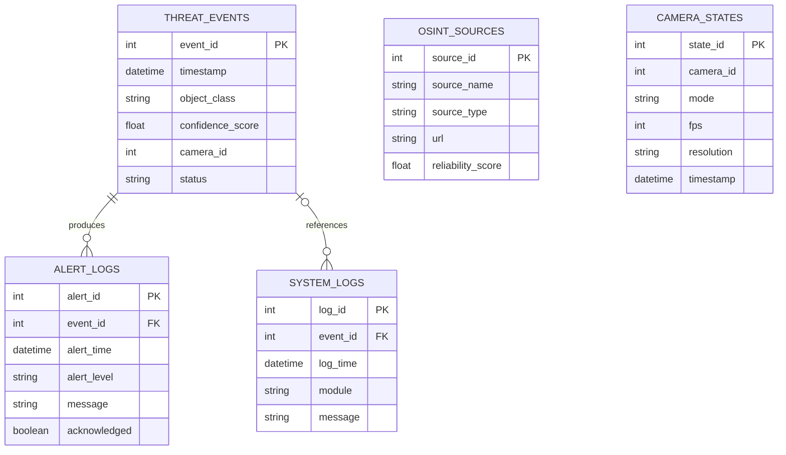

# Heimdall Database Design

## Prototype 1 scope

Prototype 1 uses PostgreSQL for the API and database demonstration. The database follows the five-table design from the May 2026 final report.

Camera hardware, YOLO detection, real OSINT ingestion, and frontend integration are outside the Prototype 1 scope.

## Entity relationship diagram



## Table purposes

### `osint_sources`

Stores information about approved public information sources.

Examples include public APIs, RSS feeds, and emergency broadcasts.

### `threat_events`

Stores possible threat detections, including the detected object, confidence score, camera, time, and review status.

### `alert_logs`

Stores alert records connected to threat events. It tracks the alert level, message, time, and whether the alert was acknowledged.

### `camera_states`

Stores camera operating-state records, including dormant or active mode, frame rate, resolution, and timestamp.

The table is included because it is part of the report design, although real camera control is not implemented in Prototype 1.

### `system_logs`

Stores important messages produced by system modules. A log may optionally reference a threat event.

## Relationships

- One threat event may have multiple alert logs.
- One threat event may have multiple system logs.
- A system log may exist without a threat event.
- OSINT sources and camera states are currently independent because the report does not define foreign-key relationships for them.

## Normalization

The schema separates different types of information into different tables:

- Source information is stored once in `osint_sources`.
- Detection information is stored in `threat_events`.
- Alert history is stored in `alert_logs`.
- Camera state history is stored in `camera_states`.
- Technical activity is stored in `system_logs`.

This reduces repeated data and makes each table responsible for one main subject.

Primary keys uniquely identify rows. Foreign keys connect related records and protect referential integrity.

## Database decision

The final report proposed SQLite for local prototyping and PostgreSQL for the complete system.

Prototype 1 uses PostgreSQL locally through Docker instead. This keeps local development closer to the planned final database and allows PostgreSQL constraints and migrations to be tested early.

Docker provides the PostgreSQL environment; Docker is not the database itself.

## Migration and rollback protocol

Before a destructive migration:

1. Confirm the Git working tree and current Alembic revision.
2. Create a PostgreSQL backup with `pg_dump`.
3. Review the generated migration.
4. Apply the migration.
5. Verify the tables and current revision.
6. Test the downgrade.
7. Reapply the migration.
8. Run automated tests before committing.

Create a backup:

```bash
mkdir -p backups
docker compose exec -T postgres pg_dump -U heimdall -d heimdall > backups/heimdall_backup.sql
```

Apply migrations:

```bash
(cd backend && alembic upgrade head)
```

Roll back the report-alignment migration:

```bash
(cd backend && alembic downgrade 226eb47c96bb)
```

Reapply it:

```bash
(cd backend && alembic upgrade head)
```

Local backups are ignored by Git because they may contain private or test data.