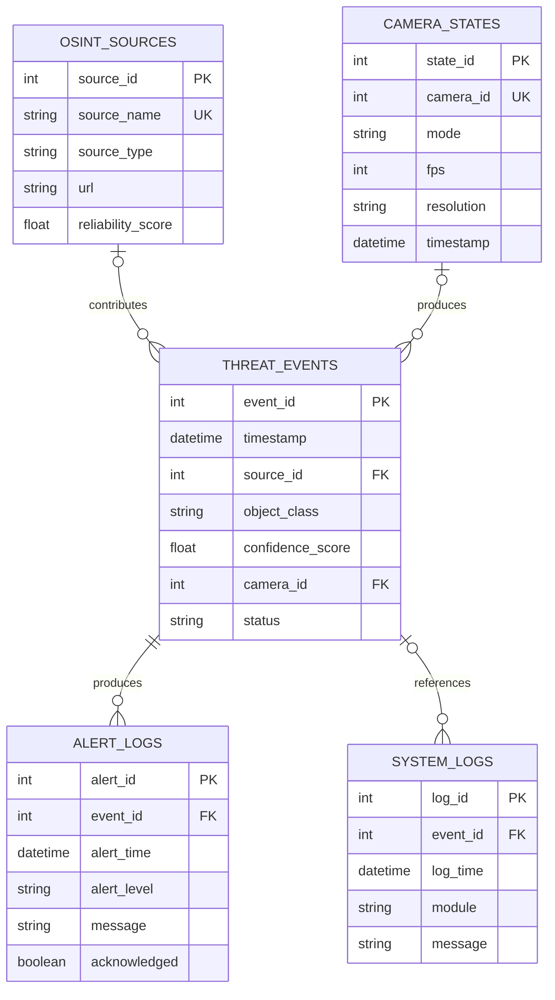

# Heimdall Database Design

## Prototype 2 scope

Prototype 2 uses PostgreSQL as the shared database for the FastAPI backend, authenticated vision pipeline, OSINT ingestion pipeline, and frontend integration.

The schema keeps source details, camera state, threat detections, alerts, technical logs, and user accounts in separate tables connected through foreign keys.

## Entity relationship diagram


```mermaid
erDiagram
    OSINT_SOURCES o|--o{ THREAT_EVENTS : contributes
    CAMERA_STATES o|--o{ THREAT_EVENTS : produces
    THREAT_EVENTS ||--o{ ALERT_LOGS : produces
    THREAT_EVENTS o|--o{ SYSTEM_LOGS : references

    OSINT_SOURCES {
        int source_id PK
        string source_name UK
        string source_type
        string url
        float reliability_score
    }

    CAMERA_STATES {
        int state_id PK
        int camera_id UK
        string mode
        int fps
        string resolution
        datetime timestamp
    }

    THREAT_EVENTS {
        int event_id PK
        datetime timestamp
        int source_id FK
        string object_class
        float confidence_score
        int camera_id FK
        string status
    }

    ALERT_LOGS {
        int alert_id PK
        int event_id FK
        datetime alert_time
        string alert_level
        string message
        boolean acknowledged
    }

    SYSTEM_LOGS {
        int log_id PK
        int event_id FK
        datetime log_time
        string module
        string message
    }
```

## Table purposes

### `osint_sources`

Stores approved OSINT source details once, including the source name, type, URL, and reliability score.

### `camera_states`

Stores one current operating-state row for each registered camera. The unique `camera_id` prevents duplicate current-state records. Repeated vision runs update the existing row instead of creating camera-state history.

### `threat_events`

Stores possible threat detections from OSINT, vision, or both. It acts as the central event table but stores foreign-key references instead of copying source or camera details.

Every threat event must have at least one origin:

- OSINT-only: `source_id` is set and `camera_id` is `NULL`.
- Vision-only: `camera_id` is set and `source_id` is `NULL`.
- Correlated evidence: both IDs may be set.

### `alert_logs`

Stores alerts generated for threat events, including severity, message, timestamp, and acknowledgement status.

### `system_logs`

Stores technical activity produced by system modules. A system log may optionally reference a threat event.

### `users`

Stores authentication accounts separately from the report-domain tables. Passwords are stored as Argon2 hashes rather than plaintext.

## Relationships and deletion behavior

- One OSINT source may contribute to many threat events.
- One registered camera may produce many threat events.
- One threat event may produce many alert logs.
- One threat event may be referenced by many system logs.
- Referenced sources and cameras use `ON DELETE RESTRICT`.
- Alert-to-event references use `ON DELETE RESTRICT` so deleting an event cannot silently erase alert evidence.
- System-log references use `ON DELETE SET NULL` so technical logs survive if an event is removed.

## Normalization audit

The schema is designed to satisfy third normal form for the current Prototype 2 fields:

- Each table represents one main subject.
- Each row has a primary key.
- Non-key fields describe that table's subject.
- Source details are stored only in `osint_sources`.
- Current camera state is stored only in `camera_states`.
- Threat events store source and camera IDs instead of duplicating their descriptive fields.
- Alert-specific fields remain in `alert_logs`.
- Technical log fields remain in `system_logs`.
- Authentication fields remain in `users`.

This structure reduces update, insertion, and deletion anomalies. Repeated OSINT reports remain separate threat events because repeated observations are evidence, not accidental database duplication.

## Database decision

The final report proposed SQLite for local prototyping and PostgreSQL for the complete system.

Prototype 2 uses PostgreSQL locally through Docker. This keeps development aligned with the intended deployment database and allows PostgreSQL constraints, foreign keys, and Alembic migrations to be tested before integration.

Docker provides the PostgreSQL environment; Docker is not the database itself.

## Migration and rollback protocol

Before a destructive migration:

1. Confirm the Git working tree and current Alembic revision.
2. Create a PostgreSQL backup with `pg_dump`.
3. Review the generated migration.
4. Apply the migration.
5. Verify the tables and current revision.
6. Test the downgrade.
7. Reapply the migration.
8. Run automated tests before committing.

Create a backup:

```bash
mkdir -p backups
docker compose exec -T postgres pg_dump -U heimdall -d heimdall > backups/heimdall_backup.sql
```

Apply migrations:

```bash
(cd backend && alembic upgrade head)
```

```markdown
Roll back the latest normalization migration:

```bash
(cd backend && alembic downgrade 4d70a0dd39ea)
```

Reapply it:

```bash
(cd backend && alembic upgrade head)
```

Local backups are ignored by Git because they may contain private or test data.