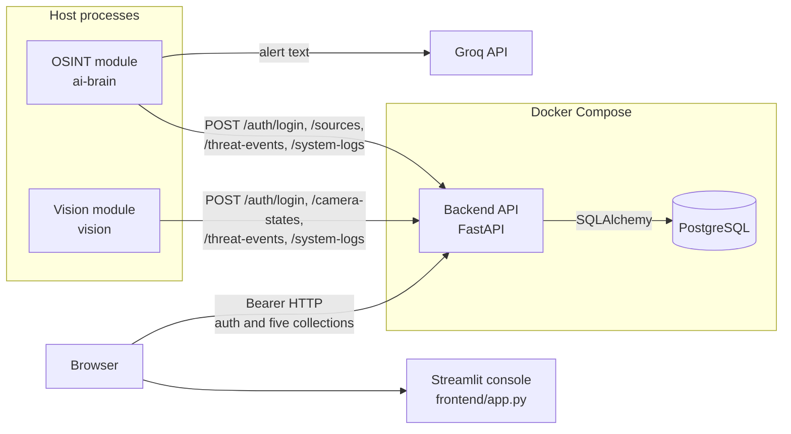
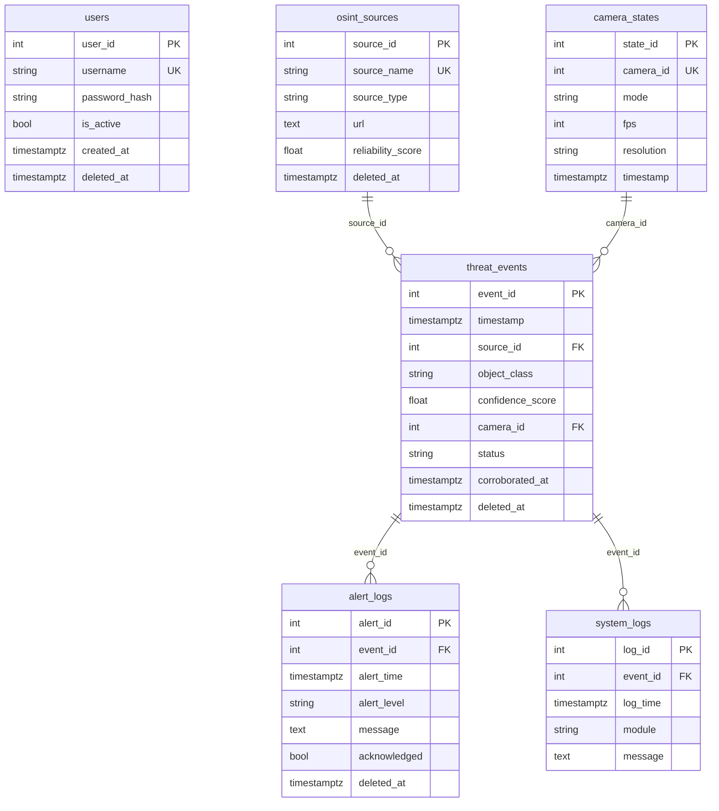
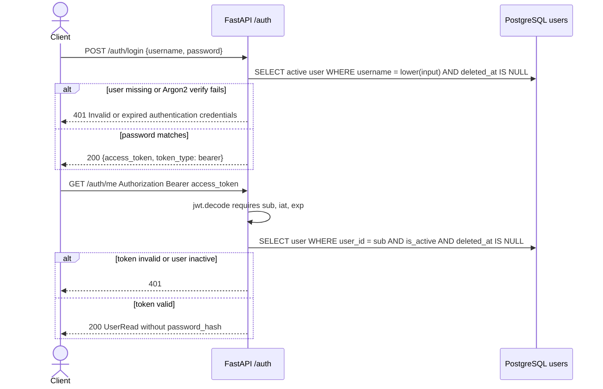

# Architecture

Heimdall in this repository is five processes that share one database through the API. OSINT and vision are not services in `docker-compose.yml`. They are host programs that call the API. The browser console calls the API directly. Nothing in `ai-brain/` imports `vision/`, or the reverse.

## Components

The OSINT entrypoint is `ai-brain/main.py`. It reads `mock_sources.json` and `mock_alerts.json`, logs in with `OSINT_API_USERNAME` and `OSINT_API_PASSWORD`, and registers sources through `ai-brain/osint_client.py`. `ai-brain/osint_agent.py` compiles a three-node LangGraph: normalize the alert, classify it with Groq (`openai/gpt-oss-20b`) into `object_class` and `confidence_score`, then `POST /threat-events` with `source_id` and `POST /system-logs`. The stored source URL is not requested.

The vision entrypoint is `vision/main.py`. `vision/detector.py` loads YOLOv8n and yields detections at or above 0.5 confidence from images in `vision/test_media/`. `vision/vision_client.py` logs in with `VISION_API_USERNAME` and `VISION_API_PASSWORD`, creates or updates camera `1` (`Active` while running, `Dormant` afterward), and posts each detection as a threat event with `camera_id` and no `source_id`, plus a system log.

`frontend/app.py` serves `frontend/heimdall_console.html` through Streamlit on port 8501. The page logs in and registers against `/auth/*`, then polls the five collection routes every five seconds with the bearer token. Compose sets `HEIMDALL_API_URL` to `http://localhost:8000` because `fetch` runs in the browser on the host, not inside the frontend container.

`docker-compose.yml` starts three services. `postgres` is PostgreSQL 17 with volume `postgres_data`. `api` runs `alembic upgrade head` and then Uvicorn (`backend.app.main:app`) on port 8000. `frontend` depends on `api` and runs Streamlit. The API uses `POSTGRES_HOST=postgres` inside the Compose network.

`frontend/demo_backend/main.py` is a separate in-memory FastAPI app with a WebSocket at `/ws/events`. `tests/test_frontend_demo_api.py` exercises it. Compose does not start it, and `backend/app/main.py` has no WebSocket route.

## Database

The diagram matches `backend/app/models.py`. `users` has no foreign keys. A threat event must have `source_id`, `camera_id`, or both (`ck_threat_events_has_origin`). `source_id` references `osint_sources.source_id` and `camera_id` references `camera_states.camera_id`, both `ON DELETE RESTRICT`. `alert_logs.event_id` is required and `ON DELETE RESTRICT`. `system_logs.event_id` is optional and `ON DELETE SET NULL`.

Reliability and confidence scores are constrained to the range 0 through 1. Camera `mode` is restricted to `Dormant` or `Active` in `backend/app/schemas.py`. Soft-deleted sources, threat events, and alert logs stay in the table and disappear from the normal GET routes. `camera_states` and `system_logs` have no `deleted_at` column.

Alembic head is revision `0dafecf04f65`. Earlier revision `017083aec8b1` drops `alert_actions` on upgrade. That table is not in the models.

## Login

`POST /auth/login` and `POST /auth/register` are implemented in `backend/app/auth.py`. Registration is a separate request. It is allowed only when `ENABLE_USER_REGISTRATION` is true, and it stores `hash_password` output rather than the password.

`backend/app/security.py` builds the JWT with `sub` set to the user id, plus `iat` and `exp`. Lifetime is `JWT_ACCESS_TOKEN_MINUTES` (default 30) and the algorithm is `JWT_ALGORITHM` (default `HS256`). The signing key is `JWT_SECRET_KEY`. `GET /auth/me` and every data route use `get_current_user`, which repeats the decode-and-load step in the diagram.

The console calls `/auth/login` and then `/auth/me` (`frontend/heimdall_console.html`). `HeimdallAPIClient` (`ai-brain/osint_client.py`) and `HeimdallVisionClient` (`vision/vision_client.py`) call `/auth/login` only, store the access token on the HTTP session, and send it on later posts. None of the three writes the token to a database. There is no refresh token and no server-side logout.
